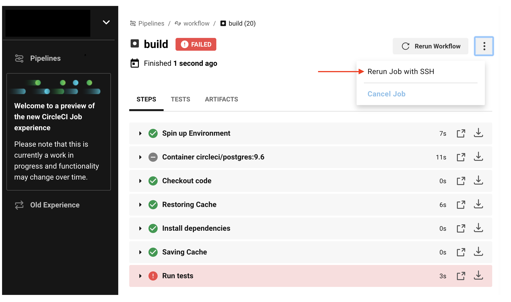
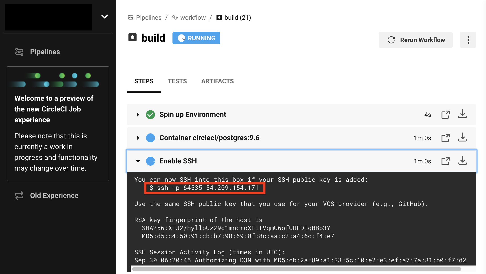
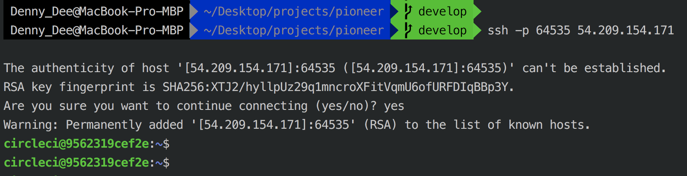

# Debugging with SSH

Often the best way to troubleshoot problems is to SSH into a job and inspect things like log files, running processes, and directory paths. When you log in with SSH, you are running an interactive login shell. You are also likely to be running the command on top of the directory where the command failed the first time, so you are not starting a clean run.

To SSH into your job:

1. Ensure that you have added an SSH key to your GitHub or Bitbucket account.
2. To start a job with SSH enabled, select the ‘Rerun job with SSH’ option from the ‘Rerun Workflow’ dropdown menu.
   
3. To see the connection details, expand the ‘Enable SSH’ section in the job output where you will see the SSH command needed to connect.
   
4. SSH to the running job to perform whatever troubleshooting you need to.
   

The build VM will remain available for an SSH connection for 10 minutes after the build finishes running. After you SSH into the build, the connection will remain open for two hours.

[Here](https://circleci.com/blog/debugging-ci-cd-pipelines-with-ssh-access/) you can find detailed example of debugging with SSH.
