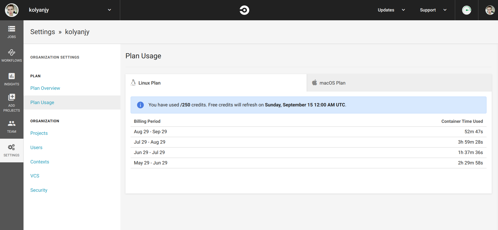

# Introduction to CircleCi

**CircleCI** is a continuous integration service for web and mobile applications.
One of the advantages of this service is the build in the cloud, that is, you do not need a local build machine. The service allows you to flexibly configure assembly testing, as the user has access to ```sudo```.

CircleCI integrates with a VCS and automatically runs a series of steps every time that it detects a change to your repository.

A CircleCI build consists of a series of steps. Generally, they’re:

- Dependencies
- Testing
- Deployment

## CircleCi - Analogues

|                              | [Circle CI](https://circleci.com/)   | [Travis CI](https://travis-ci.org/) | [Bamboo](https://www.atlassian.com/software/bamboo) | [GitLab CI](https://docs.gitlab.com/ee/ci/)       | [Jenkins](https://jenkins.io/) | [TeamCity](https://www.jetbrains.com/teamcity/) | [Codeship](https://codeship.com/) | [GitHub Actions](https://github.com/features/actions) |
| --- | --- | --- | --- | --- | --- | --- | --- | --- |
| Supports CD | yes | no | yes | yes | yes | yes | yes | yes |
| Cloud hosting | yes | yes | yes | yes | yes | no | yes | yes |
| Paid version price | $50-3,150 per month | $69-489 per month | $10-110,000 one-off payment | $4-99 per month | - | $299-21,999 one-off payment | $75-1,500 per month |  $0-4,380 per month |
| Docs and support | Good | Poor | Good | Good | Adequate | Good | Poor | Adequate |
| Learning curve and usability | Easy | Easy | Medium | Easy | Easy | Medium | Easy | Easy |
| Use case | For fast development and high budget | For small projects and startups | For Atlassian integrations |For any project | For big projects | For enterprise needs | For any project | For any project |

## Pros and Cons

### Pros:

- **Generous free plans** for open source projects easy to set up plenty of features plenty of customization runs quick

- **Simple UI**(user interface) CircleCI is recognized for its user-friendly interface for managing builds/jobs. Its single-page web app is clean and easy to understand

- **High-quality customer support.** StackShare’s community members highlight CircleCI’s speedy support: They respond to requests within 12 hours.

- CircleCI runs **all types of software tests** including web, mobile, and container environments.

- **Caching of requirements installation and third-party dependencies.** Instead of installing the environments, CircleCI can take data from multiple projects using the granular check-out-key options.

- **No need for manual debugging.** CircleCI has debugging feature Debug via SSH, but Jenkins users have to debug manually by clicking on jobs.

- ability to **local** setup CircleCi

### Cons:

- Config file ```.circleci/config.yml``` tends to get **too long** 

- **High price** for private repositories and large projects

- You can put **only one** language image in a container

- CircleCI in the free version **only** supports Ubuntu. To use MacOS or Windows you will have to pay

- The local version has a **limitation** compared to the cloud CircleCi

- **Shared containers** between all projects

## Executors and Images

### Overview

CircleCI enables you to run jobs in one of three environments:

* Within Docker images (docker)
* Within a Linux virtual machine (VM) image (machine)
* Within a macOS VM image (macos)
* Within a Windows OS VM image (macos)

It is possible to specify a different executor type for every job in your `.circleci/config.yml` by specifying the 
executor type and an appropriate image.
Main differences between using Docker and VM:

| Virtual Environment                        | Docker  | Machine   |
|--------------------------------------------|---------|-----------|
| Start time                                 | Instant | 30-60 sec |
| Clean environment                          | Yes     | Yes       |
| Custom images                              | Yes     | No        |
| Build Docker images                        | Yes     | Yes       |
| Full control over job environment          | No      | Yes       |
| Full root access                           | No      | Yes       |
| Run multiple databases                     | Yes     | Yes       |
| Run multiple versions of the same software | No      | Yes       |
| Layer caching                              | Yes     | Yes       |
| Run privileged containers                  | No      | Yes       |
| Use docker compose with volumes            | No      | Yes       |
| Configurable resources (CPU/RAM)           | Yes     | No        |

The docker key defines Docker as the underlying technology to run your jobs using Docker Containers. 
Containers are an instance of the Docker Image you specify. The first image listed in your configuration is 
the primary container image in which all steps run. All other containers run in a common network and every exposed 
port will be available on localhost from a primary container.

### Pre-Built CircleCI Docker Images

For convenience, CircleCI maintains several Docker images. These images are typically extensions of official Docker 
images and include tools especially useful for CI/CD. All of these pre-built images are available in the [CircleCI org
on Docker Hub](https://hub.docker.com/search?q=circleci&type=image). 

CircleCI’s convenience images fall into two categories: **language images** and **service images**. 
All images add a circleci user as a system user.

### Language Images

Language images are convenience images for common programming languages. These images include both the relevant 
language and commonly-used tools. A language image should be listed first under the docker key in your configuration, 
making it the primary container during execution.

CircleCI maintains images for the languages below.

* Android
* Clojure
* Elixir
* Go (Golang)
* JRuby
* Node.js
* OpenJDK (Java)
* PHP
* Python
* Ruby
* Rust

### Language Image Variants

CircleCI maintains several variants for language images. To use these variants, add one of the following suffixes 
to the end of an image tag.

* `-node` includes Node.js for polyglot applications
* `-browsers` includes Chrome, Firefox, Java 8, and Geckodriver
* `-browsers-legacy` includes Chrome, Firefox, Java 8, and PhantomJS
* `-node-browsers` combines the -node and -browsers variants
* `-node-browsers-legacy` combines the -node and -browsers-legacy variants

### Service Images

Service images are convenience images for services like databases. These images should be listed after language images 
so they become secondary service containers.

CircleCI maintains images for the services below.

* buildpack-deps
* DynamoDB
* MariaDB
* MongoDB
* MySQL
* PostgreSQL
* Redis

### Sample Configuration

```yml
version: 2
jobs:
  build:
    docker:
      - image: circleci/ruby:2.6.1-node
      - image: circleci/postgres:11.5
      - image: redis
```


## Environment variables

Environment variables are used according to a specific precedence order, as follows:

1. Environment variables declared inside a shell command in a run step, for example FOO=bar make install.
2. Environment variables declared with the environment key for a run step.
3. Environment variables set with the environment key for a job.
4. Environment variables set with the environment key for a container.
5. Context environment variables (assuming the user has access to the Context).
6. Project-level environment variables set on the Project Settings page.
7. Special CircleCI environment variables.

**Note:** Do not add secrets or keys inside the `.circleci/config.yml` file. The full text of `config.yml` is visible to 
developers with access to your project on CircleCI. Store secrets or keys in project or context settings 
in the CircleCI app.

### Setting an Environment Variable in a Shell Command

While CircleCI does not support interpolation when setting environment variables, it is possible to set variables for 
the current shell by using BASH_ENV. This is useful for both modifying your PATH and setting environment variables 
that reference other variables.

In every step, CircleCI uses bash to source BASH_ENV. This means that BASH_ENV is automatically loaded and run, 
allowing you to use interpolation and share environment variables across run steps.

```yml
version: 2
jobs:
  build:
    docker:
      - image: smaant/lein-flyway:2.7.1-4.0.3
    steps:
      - run:
          name: Update PATH and Define Environment Variable at Runtime
          command: |
            echo 'export PATH=/path/to/foo/bin:$PATH' >> $BASH_ENV
            echo 'export VERY_IMPORTANT=$(cat important_value)' >> $BASH_ENV
            source $BASH_ENV
```

### Setting an Environment Variable in a Step, Job, Container
To set an environment variable use the environment key.

```yml
version: 2
jobs:
  build:
    docker:
      - image: smaant/lein-flyway:2.7.1-4.0.3
      - image: circleci/postgres:9.6-jessie
      # environment variables for all commands executed in the primary container
        environment:
          POSTGRES_USER: conductor
          POSTGRES_DB: conductor_test
  # environment variables for all commands executed in the job
    environment:
      JOB_VARIABLE: 'foo'
    steps:
      - checkout
      - run:
          name: Run migrations
          command: sql/docker-entrypoint.sh sql
          # Environment variable for a single command shell
          environment:
            DATABASE_URL: postgres://conductor:@localhost:5432/conductor_test
```

### Setting an Environment Variable in a Project

1. In the CircleCI application, go to your project’s settings by clicking the gear icon next to your project.
2. In the **Build Settings** section, click on **Environment Variables**.
3. Import variables from another project by clicking the **Import Variable(s)** button. Add new variables by clicking 
the **Add Variable** button.
4. Use your new environment variables in your `.circleci/config.yml` file.

Once created, environment variables are hidden and uneditable in the application. Changing an environment variable 
is only possible by deleting and recreating it.

### Injecting Environment Variables with the API

Build parameters are environment variables, therefore their names have to meet the following restrictions:

* They must contain only ASCII letters, digits and the underscore character.
* They must not begin with a number.
* They must contain at least one character.

Aside from the usual constraints for environment variables there are no restrictions on the values themselves and 
are treated as simple strings. The order that build parameters are loaded in is not guaranteed so avoid interpolating 
one build parameter into another. It is best practice to set build parameters as an unordered list of independent 
environment variables.

```bash
curl \
  --header "Content-Type: application/json" \
  --data '{"build_parameters": {"param1": "value1", "param2": 500}}' \
  --request POST \
  https://circleci.com/api/v1.1/project/github/circleci/mongofinil/tree/master?circle-token=$CIRCLE_TOKEN
```

In the above example, `$CIRCLE_TOKEN` is a personal API token.

### Built-in Environment Variables

| Variable                  | Type    | Value                                                                                                                                     |
|---------------------------|---------|-------------------------------------------------------------------------------------------------------------------------------------------|
| CI                        | Boolean | true (represents whether the current environment is a CI environment)                                                                     |
| CI_PULL_REQUEST           | String  | Deprecated version of CIRCLE_PULL_REQUEST. Kept for backward compatibility with CircleCI 1.0.                                             |
| CI_PULL_REQUESTS          | List    | Deprecated version of CIRCLE_PULL_REQUESTS. Kept for backward compatibility with CircleCI 1.0.                                            |
| CIRCLE_BRANCH             | String  | The name of the Git branch currently being built.                                                                                         |
| CIRCLE_BUILD_NUM          | Integer | The number of the CircleCI build.                                                                                                         |
| CIRCLE_BUILD_URL          | String  | The URL for the current build.                                                                                                            |
| CIRCLE_COMPARE_URL        | String  | The GitHub or Bitbucket URL to compare commits of a build.                                                                                |
| CIRCLE_INTERNAL_TASK_DATA | String  | The directory where test timing data is saved.                                                                                            |
| CIRCLE_JOB                | String  | The name of the current job.                                                                                                              |
| CIRCLE_NODE_INDEX         | Integer | The index of the specific build instance. A value between 0 and (CIRCLECI_NODE_TOTAL - 1)                                                 |
| CIRCLE_NODE_TOTAL         | Integer | The number of total build instances.                                                                                                      |
| CIRCLE_PR_NUMBER          | Integer | The number of the associated GitHub or Bitbucket pull request. Only available on forked PRs.                                              |
| CIRCLE_PR_REPONAME        | String  | The name of the GitHub or Bitbucket repository where the pull request was created. Only available on forked PRs.                          |
| CIRCLE_PR_USERNAME        | String  | The GitHub or Bitbucket username of the user who created the pull request. Only available on forked PRs.                                  |
| CIRCLE_PREVIOUS_BUILD_NUM | Integer | The number of previous builds on the current branch.                                                                                      |
| CIRCLE_PROJECT_REPONAME   | String  | The name of the repository of the current project.                                                                                        |
| CIRCLE_PROJECT_USERNAME   | String  | The GitHub or Bitbucket username of the current project.                                                                                  |
| CIRCLE_PULL_REQUEST       | String  | The URL of the associated pull request. If there are multiple associated pull requests, one URL is randomly chosen.                       |
| CIRCLE_PULL_REQUESTS      | List    | Comma-separated list of URLs of the current build’s associated pull requests.                                                             |
| CIRCLE_REPOSITORY_URL     | String  | The URL of your GitHub or Bitbucket repository.                                                                                           |
| CIRCLE_SHA1               | String  | The SHA1 hash of the last commit of the current build.                                                                                    |
| CIRCLE_TAG                | String  | The name of the git tag, if the current build is tagged. For more information, see the Git Tag Job Execution.                             |
| CIRCLE_USERNAME           | String  | The GitHub or Bitbucket username of the user who triggered the build.                                                                     |
| CIRCLE_WORKFLOW_ID        | String  | A unique identifier for the workflow instance of the current job. This identifier is the same for every job in a given workflow instance. |
| CIRCLE_WORKING_DIRECTORY  | String  | The value of the working_directory key of the current job.                                                                                |
| CIRCLECI                  | Boolean | true (represents whether the current environment is a CircleCI environment)                                                               |
| HOME                      | String  | Your home directory.                                                                                                                      |

### Best Practices
* The best way to store environment variables is keeping them in the repository. In this way you avoid problems with 
absent or wrong variables. 

* Variables, that needed only on CircleCI or secret variables, should be stored in CircleCi 
Project Setting page.

* We recommend keeping cache sizes **under 500MB**. This is our upper limit for corruption checks because above this limit check times would be excessively long. You can view the cache size from the CircleCI Jobs page within the `restore_cache` step. 

## Caching

Caching is one of the most effective ways to make jobs faster on CircleCI by reusing the data from expensive fetch operations from previous jobs.

A good example is package dependency managers such as Yarn, Bundler, or Pip. With dependencies restored from a cache, commands like yarn install will only need to download new dependencies, if any, and not redownload everything on every build.

Automatic dependency caching is not available in CircleCI 2.0, so it is important to plan and implement your caching strategy to get the best performance. Manual configuration in 2.0 enables more advanced strategies and finer control.

**Note:** The Docker images used for CircleCI 2.0 job runs are automatically cached on the server infrastructure where possible.

Sometimes for large projects it’s beneficial to cache the git repository. Here is an example of source caching:
```
    steps:
      - restore_cache:
          keys:
            - source-v1-{{ .Branch }}-{{ .Revision }}
            - source-v1-{{ .Branch }}-
            - source-v1-

      - checkout

      - save_cache:
          key: source-v1-{{ .Branch }}-{{ .Revision }}
          paths:
            - ".git"
```
### Cache Expiration
 The caches created via the save_cache step are stored for up to **30 days**.

### Clearing Cache
For example, you may want to clear the cache in the following scenarios by incrementing the cache key name:

- Dependency manager version change, for example, you change npm from 4 to 5
- Language version change, for example, you change ruby 2.3 to 2.4
- Dependencies are removed from your project

In order to clear the cache, you need to change the name of the key under which it is stored for example:
```
  - v1-npm-deps-{{ checksum "package-lock.json" }} 
```
  change to
```
  - v2-npm-deps-{{ checksum "package-lock.json" }}
```

### Keys and Templates

A cache stores a hierarchy of files under a key.
Following are keys examples for different goals:
`myapp-{{ checksum "package-lock.json" }}` - Cache will be regenerated every time something is changed in package-lock.json file, different branches of this project will generate the same cache key.
`myapp-{{ .Branch }}-{{ checksum "package-lock.json" }}` - Cache will be regenerated every time something is changed in package-lock.json file, different branches of this project will generate separate cache keys.
`myapp-{{ epoch }}` - Every build will generate separate cache keys.
During step execution, the templates above will be replaced by runtime values and use the resultant string as the key.

The following table describes the available cache key templates:

| **Template**                        | **Description**                                                                                                                                                                                                                                                                                                                                                                                                                                                                |
|---------------------------------|----------------------------------------------------------------------------------------------------------------------------------------------------------------------------------------------------------------------------------------------------------------------------------------------------------------------------------------------------------------------------------------------------------------------------------------------------------------------------|
| {{ .Branch }}                   | The VCS branch currently being built.                                                                                                                                                                                                                                                                                                                                                                                                                                      |
| {{ .BuildNum }}                 | The CircleCI job number for this build.                                                                                                                                                                                                                                                                                                                                                                                                                                    |
| {{ .Revision }}                 | The VCS revision currently being built.                                                                                                                                                                                                                                                                                                                                                                                                                                    |
| {{ .Environment.variableName }} | The environment variable variableName (supports any environment variable exported by CircleCI or added to a specific Context—not any arbitrary environment variable).                                                                                                                                                                                                                                                                                                      |
| {{ checksum "filename" }}       | A base64 encoded SHA256 hash of the given filename’s contents, so that a new cache key is generated if the file changes. This should be a file committed in your repo. Consider using dependency manifests, such as package-lock.json, pom.xml or project.clj. The important factor is that the file does not change between restore_cache and save_cache, otherwise the cache will be saved under a cache key that is different from the file used at restore_cache time. |
| {{ epoch }}                     | The number of seconds that have elapsed since 00:00:00 Coordinated Universal Time (UTC), also known as POSIX or Unix epoch.                                                                                                                                                                                                                                                                                                                                                |
| {{ arch }}                      | Captures OS and CPU (architecture, family, model) information. Useful when caching compiled binaries that depend on OS and CPU architecture, for example, darwin-amd64-6_58 versus linux-amd64-6_62.                                                                                                                                                                                                                                      |

### Full Example of Saving and Restoring Cache

```
steps:
  - checkout

  # Run bundler
  # Load installed gems from cache if possible, bundle install then save cache
  # Multiple caches are used to increase the chance of a cache hit

  - restore_cache:
      keys:
        # CircleCI restores caches in the order of keys listed in the restore_cache step.
        # Each cache key is namespaced to the project, and retrieval is prefix-matched.
        # The cache will be restored from the first matching key.
        - gem-cache-v1-{{ arch }}-{{ .Branch }}-{{ checksum "Gemfile.lock" }}
        - gem-cache-v1-{{ arch }}-{{ .Branch }}
        - gem-cache-v1

  - run: bundle install --path vendor/bundle

  - save_cache:
      key: gem-cache-v1-{{ arch }}-{{ .Branch }}-{{ checksum "Gemfile.lock" }}
      paths:
        - vendor/bundle

  # Precompile assets
  # Load assets from cache if possible, precompile assets then save cache
  # Multiple caches are used to increase the chance of a cache hit

  - restore_cache:
      keys:
        - asset-cache-v1-{{ arch }}-{{ .Branch }}-{{ .Environment.CIRCLE_SHA1 }}
        - asset-cache-v1-{{ arch }}-{{ .Branch }}
        - asset-cache-v1

  - run: bundle exec rake assets:precompile

  - save_cache:
      key: asset-cache-v1-{{ arch }}-{{ .Branch }}-{{ .Environment.CIRCLE_SHA1 }}
      paths:
        - public/assets
        - tmp/cache/assets/sprockets

  - run: bundle exec rspec
```

### Best Practices
- If your source code changes frequently, use fewer, more specific keys. This produces a more granular source cache that will update more often as the current branch and git revision change. E.g. `source-v1-{{ .Branch }}-{{ .Revision }}`
- Use checksum for lockfiles (for example, `Gemfile.lock` or `yarn.lock`)


## Containers

A container is a standard unit of software that packages up code and all its dependencies so the application runs quickly and reliably from one computing environment to another. A Docker container image is a lightweight, standalone, executable package of software that includes everything needed to run an application: code, runtime, system tools, system libraries and settings

Container images become containers at runtime and in the case of Docker containers - images become containers when they run on [Docker Engine](https://www.docker.com/products/container-runtime) . Available for both Linux and Windows-based applications, containerized software will always run the same, regardless of the infrastructure. Containers isolate software from its environment and ensure that it works uniformly despite differences for instance between development and staging.

Every change committed to your version control system triggers CircleCI to checkout your code and run your job workflow inside a fresh, on-demand, isolated container with access to the following, depending on your plan:

- **Concurrency** - Utilizing multiple containers to run multiple builds at the same time. To take advantage of concurrency, configure your development workflow using the [Orchestrating Workflows document](https://circleci.com/docs/2.0/workflows/) and run your jobs in parallel as shown in the [Sample 2.0 Config Files document](https://circleci.com/docs/2.0/sample-config/#sample-configuration-with-parallel-jobs).

- **Parallelism** - Splitting tests across multiple containers, allowing you to dramatically speed up your test suite. Update your ```.circleci/config.yml``` file to run your tests in parallel as described in the [Configuring CircleCI](https://circleci.com/docs/2.0/configuration-reference/#parallelism) document. Learn how to update your config file to parallelize and split tests to decrease your build time by reading the [Running Tests in Parallel](https://circleci.com/docs/2.0/parallelism-faster-jobs/) documentation.


## Parallelism
If your project has a large number of tests, it will need more time to run them on one machine. To reduce this time, you can run tests in parallel by spreading them across multiple machines. This requires specifying a parallelism level. You can use either the CircleCI CLI to split test files, or use environment variables to configure each parallel machine individually.

### Specifying a Job’s Parallelism Level
Test suites are conventionally defined at the job level in your ```.circleci/config.yml``` file. The ```parallelism``` key specifies how many independent executors will be set up to run the steps of a job.

To run a job’s steps in parallel, set the ```parallelism``` key to a value greater than 1.

```yml
# ~/.circleci/config.yml
version: 2
jobs:
  test:
    docker:
      - image: circleci/<language>:<version TAG>
    parallelism: 4
```

## Project configurations
CircleCI provides Project and Org settings with encrypted storage in the CircleCI app.

### Project Settings Page


### Overview
To support the open source community, projects that are public on GitHub or Bitbucket receive three free build containers, for a total of four containers. Multiple build containers allow you to build a single pull request (PR) faster with parallelism, or build multiple PRs at once.

These additional containers are automatically enabled, as long as the project is public and running on Linux. If you do not want to use the additional containers or do not want your CircleCI project to be public, you can change this setting. In the **Advanced Settings** of your project, set the **Free and Open Source** option to Off.

**Note:** If you are building an open source project on macOS, contact billing@circleci.com to enable these additional containers.

### Security
While open source can be a liberating practice, take care not to liberate sensitive information.

- If your repository is public, your CircleCI project and its build logs are also public. Pay attention to the information you choose to print.

- Environment variables set in the CircleCI application are hidden from the public, these variables will not be shared in [forked PRs](https://circleci.com/docs/2.0/oss/#pass-secrets-to-builds-from-forked-pull-requests) unless explicitly enabled.

### Private Environment Variables
Many projects require API tokens, SSH keys, or passwords. Private environment variables allow you to safely store secrets, even if your project is public. For more information, see the [Environment Variables](https://circleci.com/docs/2.0/env-vars/#setting-an-environment-variable-in-a-project) document.

### Only Build Pull Requests
By default, CircleCI builds every commit from every branch. This behavior may be too aggressive for open source projects, which often have significantly more commits than private projects. To change this setting, go to the **Advanced Settings** of your project and set the **Only build pull requests** option to On.

**Note:** Even if this option is enabled, CircleCI will still build all commits from your project’s default branch.

### Build Pull Requests From Forked Repositories
Many open source projects accept PRs from forked repositories. Building these PRs is an effective way to catch bugs before manually reviewing changes.

By default, CircleCI does not build PRs from forked repositories. To change this setting, go to the **Advanced Settings** of your project and set the **Build forked pull requests** option to On.

### Caching
Caches are isolated based on GitHub Repo for PRs. CircleCI uses the GitHub repository-id of the originator of the fork PR to identify the cache.

- PRs from the same fork repo will share a cache (this includes, as previously stated, that PRs in the master repo share a cache with master).

- Two PRs in different Fork Repos will have different caches.

Currently there is no pre-population of caches because this optimization hasn’t made it to the top of the priority list yet.

## Steps
The steps setting in a job should be a list of single key/value pairs, the key of which indicates the step type. The value may be either a configuration map or a string (depending on what that type of step requires). For example, using a map:
``` yml
jobs:
  build:
    working_directory: ~/canary-python
    environment:
      FOO: bar
    steps:
      - run:
          name: Running tests
          command: make test
```

Here ```run``` is a step type. The ```name``` attribute is used by the UI for display purposes. The ```command``` attribute is specific for ```run``` step and defines command to execute.

Some steps may implement a shorthand semantic. For example, ```run``` may be also be called like this:

```yml
jobs:
  build:
    steps:
      - run: make test
```
In its short form, the run step allows us to directly specify which command to execute as a string value. In this case step itself provides default suitable values for other attributes (name here will have the same value as command, for example).

## Jobs
A run is comprised of one or more named jobs. Jobs are specified in the ```jobs``` map, see [Sample 2.0 config.yml](https://circleci.com/docs/2.0/sample-config/) for two examples of a job map. The name of the job is the key in the map, and the value is a map describing the job.

If you are using [Workflows](https://circleci.com/docs/2.0/workflows/), jobs must have a name that is unique within the ```.circleci/config.yml``` file.

If you are **not** using workflows, the jobs map must contain a job named ```build```. This ```build``` job is the default entry-point for a run that is triggered by a push to your VCS provider. It is possible to then specify additional jobs and run them using the CircleCI API.

**Note:** Jobs have a maximum runtime of 5 hours. If your jobs are timing out, consider running some of them in parallel.

Each job consists of the job’s name as a key and a map as a value. A name should be unique within a current jobs list. The value map has the following attributes:

| **key**       | **Required**   | **Type**  | **Description** 
| --- | ---| ---| ---|
| docker | Y | List | Options for [docker executor](https://circleci.com/docs/2.0/configuration-reference/#docker) |
| machine | Y | Map | Options for [machine executor](https://circleci.com/docs/2.0/configuration-reference/#machine)|
| macos | Y | Map | Options for [macOS executor](https://circleci.com/docs/2.0/configuration-reference/#macos) |
| shell | N | String | Shell to use for execution command in all steps. Can be overridden by shell in each step (default: See [Default Shell Options](https://circleci.com/docs/2.0/configuration-reference/#default-shell-options))|
| steps | N | List | A list of steps to be performed |
| working_directory | N | String | In which directory to run the steps. Default: ```~/project``` (where ```project``` is a literal string, not the name of your specific project). Processes run during the job can use the ```$CIRCLE_WORKING_DIRECTORY``` environment variable to refer to this directory. **Note**: Paths written in your YAML configuration file will not be expanded; if your ```store_test_results.path``` is ```$CIRCLE_WORKING_DIRECTORY/tests```, then CircleCI will attempt to store the ```test``` subdirectory of the directory literally named ```$CIRCLE_WORKING_DIRECTORY```, dollar sign ```$``` and all. |
| parallelism | N | Integer | Number of parallel instances of this job to run (default: 1) |
| environment | N | Map | A map of environment variable names and values. |
| branches | N | Map | 	A map defining rules for allow/block execution of specific branches for a single job that is not in a workflow or a 2.1 config (default: all allowed). See [Workflows]() for configuring branch execution for jobs in a workflow or 2.1 config. |

## Workflows
A **workflow** is a set of rules for defining a collection of jobs and their run order. Workflows support complex job orchestration using a simple set of configuration keys to help you resolve failures sooner.

With workflows, you can:

- Run and troubleshoot jobs independently with real-time status feedback.
- Schedule workflows for jobs that should only run periodically.
- Fan-out to run multiple jobs in parallel for efficient version testing.
- Fan-in to quickly deploy to multiple platforms.

For example, if only one job in a workflow fails, you will know it is failing in real-time. Instead of wasting time waiting for the entire build to fail and rerunning the entire job set, you can rerun just the failed job.

### States
Workflows may appear with one of the following states:

- RUNNING: Workflow is in progress
- NOT RUN: Workflow was never started
- CANCELLED: Workflow was cancelled before it finished
- FAILING: A job in the workflow has failed. Workflows go into Failing state when one of the jobs within the graph has failed while other jobs are still running. Failing state indicates that the workflow is eventually going to fail.
- FAILED: One or more jobs in the workflow failed. Failed state is when one or more jobs in the workflow graph have failed. Failed is a terminal state.
- SUCCESS: All jobs in the workflow completed successfully
- ON HOLD: A job in the workflow is waiting for approval
- NEEDS SETUP: A workflow stanza is not included or is incorrect in the config.yml file for this project


### Limitations
Projects that have pipelines enabled may use the CircleCI API to trigger workflows. Projects that do not enable pipelines will run as if the workflows did not exist when triggered by the API. Note: Builds without workflows require a ```build``` job.

Refer to the [Workflows](https://circleci.com/docs/2.0/faq/) section of the FAQ for additional information and limitations.

### Workflows Configuration Examples
For a full specification of the ```workflows``` key, see the [Workflows](https://circleci.com/docs/2.0/configuration-reference/#workflows) section of the Configuring CircleCI document.

**Note:** Projects configured with Workflows often include multiple jobs that share syntax for Docker images, environment variables, or ```run``` steps. Refer the [YAML Anchors/Aliases](https://yaml.org/spec/1.2/spec.html#id2765878) documentation for information about how to alias and reuse syntax to keep your ```.circleci/config.yml``` file small. See the [Reuse YAML in the CircleCI Config](https://circleci.com/blog/circleci-hacks-reuse-yaml-in-your-circleci-config-with-yaml/) blog post for a summary.

To run a set of parallel jobs, add a new ```workflows```: section to the end of your existing ```.circleci/config.yml``` file with the version and a unique name for the workflow. The following sample ```.circleci/config.yml``` file shows the default workflow orchestration with two parallel jobs. It is defined by using the ```workflows```: key named ```build_and_test``` and by nesting the ```jobs:``` key with a list of job names. The jobs have no dependencies defined, therefore they will run in parallel.

```yml
jobs:
  build:
    docker:
      - image: circleci/<language>:<version TAG>
    steps:
      - checkout
      - run: <command>
  test:
    docker:
      - image: circleci/<language>:<version TAG>
    steps:
      - checkout
      - run: <command>
workflows:
  version: 2
  build_and_test:
    jobs:
      - build
      - test
```
See the [Sample Parallel Workflow config](https://github.com/CircleCI-Public/circleci-demo-workflows/blob/parallel-jobs/.circleci/config.yml) for a full example.


