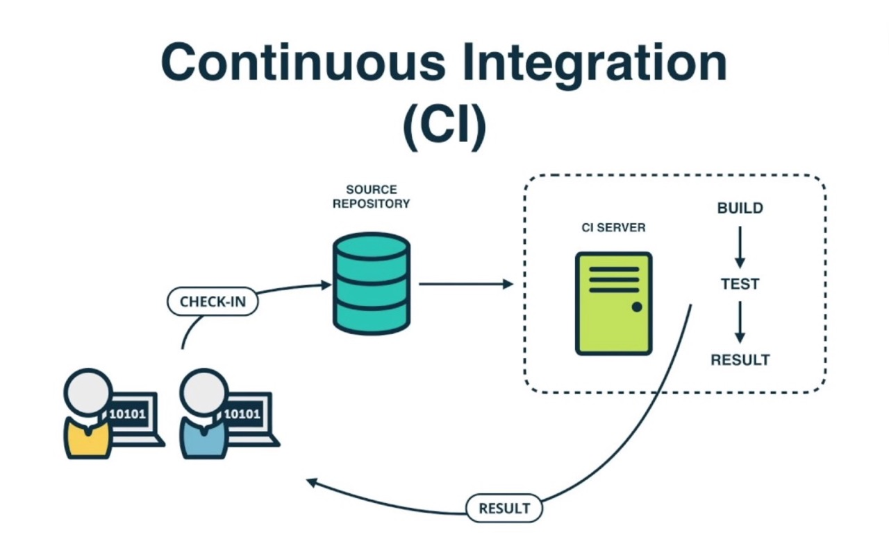
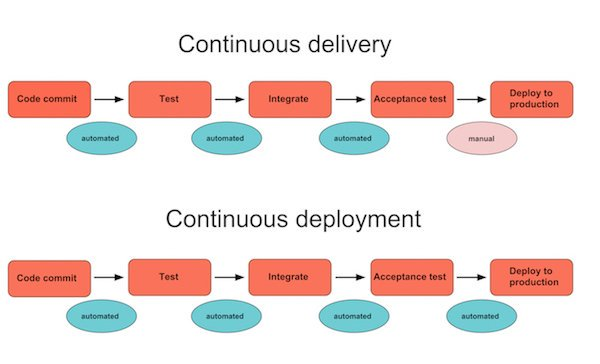

## Introduction to Continuous strategies

### Why we use that?

You have a project. You have a team working on this project. Your team deliver some amount of features/per day/per week/ per sprint. All participants of your team want to be sure that your repository contains stable and covered with specs code.

The needs associated with merging code grows every day and you also want some git branch after code base updating being sent to some stage(dev/staging/production e.t.c)

### Under control!

All of these cases could be handled with continuous strategies!

- Continuous integration
- Continuous delivery
- Continuous deployment

### Continuous integration

It's is a development practice that requires developers to integrate code into a shared repository several times a day.

Each check-in is then verified by an automated build, allowing teams to detect problems early.



### Benefits

- Say goodbye to long and tense integrations
- Increase visibility enabling greater communication
- Catch issues early and nip them in the bud
- Spend less time debugging and more time adding features
- Build a solid foundation
- Stop waiting to find out if your code’s going to work
- Reduce integration problems allowing you to deliver software more rapidly

### Continuous delivery

Continuous delivery is an extension of continuous integration to make sure that you can release new changes to your customers quickly in a sustainable way. This means that on top of having automated your testing, you also have automated your release process and you can deploy your application at any point of time by clicking on a button.

With continuous delivery, you can decide to release daily, weekly, fortnightly, or whatever suits your business requirements.

### Benefits

- The complexity of deploying software has been taken away. Your team doesn't have to spend days preparing for a release anymore.
- You can release more often, thus accelerating the feedback loop with your customers.
- There is much less pressure on decisions for small changes, hence encouraging iterating faster.

### Continuous deployment

Continuous deployment goes one step further than continuous delivery. With this practice, every change that passes all stages of your production pipeline is released to your customers. There's no human intervention, and only a failed test will prevent a new change to be deployed to production.

It is an excellent way to accelerate the feedback loop with your customers and take pressure off the team as there isn't a **Release Day** anymore. Developers can focus on building software, and they see their work go live minutes after they've finished working on it.

### Benefits

- You can develop faster as there's no need to pause development for releases. Deployments pipelines are triggered automatically for every change.
- Releases are less risky and easier to fix in case of problem as you deploy small batches of changes.
- Customers see a continuous stream of improvements, and quality increases every day, instead of every month, quarter or year.



### Final picture


## CircleCI Introduction

## CircleCi - Analogues

|                              | [Circle CI](https://circleci.com/)   | [Travis CI](https://travis-ci.org/) | [Bamboo](https://www.atlassian.com/software/bamboo) | [GitLab CI](https://docs.gitlab.com/ee/ci/)       | [Jenkins](https://jenkins.io/) | [TeamCity](https://www.jetbrains.com/teamcity/) | [Codeship](https://codeship.com/) |
|------------------------------|--------------------------------------|-------------------------------------|-----------------------------------------------------|---------------------------------------------------|--------------------------------|-------------------------------------------------|-----------------------------------|
| Supports CD                  | yes                                  | no                                  | yes                                                 | yes                                               | yes                            | yes                                             | yes                               |
| Cloud hosting                | yes                                  | yes                                 | yes                                                 | yes                                               | yes                            | no                                              | yes                               |
| License                      | Proprietary                          | MIT                                 | Proprietary                                         | MIT/EE                                            | MIT                            | Proprietary                                     | Proprietary                       |
| Paid version price           | $50-3,150 per month                  | $69-489 per month                   | $10-110,000 one-off payment                         | $4-99 per month                                   | -                              | $299-21,999 one-off payment                     | $75-1,500 per month               |
| Free version                 | yes                                  | yes                                 | yes                                                 | yes                                               | yes                            | yes                                             | yes                               |
| Special feature              | Easy to use                          | Direct connectivity with GitHub     |                                                     | Awesome Docker support | A lot of plugins               | Gated commits                                   | Pro & Basic versions              |
| Docs and support             | Good                                 | Poor                                | Good                                                | Good                                              | Adequate                       | Good                                            | Poor                              |
| Learning curve and usability | Easy                                 | Easy                                | Medium                                              | Easy                                              | Easy                           | Medium                                          | Easy                              |
| Use case                     | For fast development and high budget | For small projects and startups     | For Atlassian integrations                          | For any project                                   | For big projects               | For enterprise needs                            | For any project                   |

## Pros and Cons

#### Main CircleCI strength

**Simple UI.** CircleCI is recognized for its user-friendly interface for managing builds/jobs. Its single-page web app is clean and easy to understand
**High-quality customer support.** StackShare’s community members highlight CircleCI’s speedy support: They respond to requests within 12 hours.
CircleCI runs **all types of software tests** including web, mobile, and container environments.
**Caching of requirements installation and third-party dependencies.** Instead of installing the environments, CircleCI can take data from multiple projects using the granular check-out-key options.
**No need for manual debugging.** CircleCI has debugging feature Debug via SSH, but Jenkins users have to debug manually by clicking on jobs.

## Executors and Images

#### Overview

CircleCI enables you to run jobs in one of three environments:

* Within Docker images (docker)
* Within a Linux virtual machine (VM) image (machine)
* Within a macOS VM image (macos)

It is possible to specify a different executor type for every job in your `.circleci/config.yml` by specifying the 
executor type and an appropriate image.
Main differences between using Docker and VM:

| Virtual Environment                        | Docker  | Machine   |
|--------------------------------------------|---------|-----------|
| Start time                                 | Instant | 30-60 sec |
| Clean environment                          | Yes     | Yes       |
| Custom images                              | Yes     | No        |
| Build Docker images                        | Yes     | Yes       |
| Full control over job environment          | No      | Yes       |
| Full root access                           | No      | Yes       |
| Run multiple databases                     | Yes     | Yes       |
| Run multiple versions of the same software | No      | Yes       |
| Layer caching                              | Yes     | Yes       |
| Run privileged containers                  | No      | Yes       |
| Use docker compose with volumes            | No      | Yes       |
| Configurable resources (CPU/RAM)           | Yes     | No        |

The docker key defines Docker as the underlying technology to run your jobs using Docker Containers. 
Containers are an instance of the Docker Image you specify. The first image listed in your configuration is 
the primary container image in which all steps run. All other containers run in a common network and every exposed 
port will be available on localhost from a primary container.

#### Pre-Built CircleCI Docker Images

For convenience, CircleCI maintains several Docker images. These images are typically extensions of official Docker 
images and include tools especially useful for CI/CD. All of these pre-built images are available in the [CircleCI org
on Docker Hub](https://hub.docker.com/search?q=circleci&type=image). 

CircleCI’s convenience images fall into two categories: **language images** and **service images**. 
All images add a circleci user as a system user.

#### Language Images

Language images are convenience images for common programming languages. These images include both the relevant 
language and commonly-used tools. A language image should be listed first under the docker key in your configuration, 
making it the primary container during execution.

CircleCI maintains images for the languages below.

* Android
* Clojure
* Elixir
* Go (Golang)
* JRuby
* Node.js
* OpenJDK (Java)
* PHP
* Python
* Ruby
* Rust

#### Language Image Variants

CircleCI maintains several variants for language images. To use these variants, add one of the following suffixes 
to the end of an image tag.

* `-node` includes Node.js for polyglot applications
* `-browsers` includes Chrome, Firefox, Java 8, and Geckodriver
* `-browsers-legacy` includes Chrome, Firefox, Java 8, and PhantomJS
* `-node-browsers` combines the -node and -browsers variants
* `-node-browsers-legacy` combines the -node and -browsers-legacy variants

#### Service Images

Service images are convenience images for services like databases. These images should be listed after language images 
so they become secondary service containers.

CircleCI maintains images for the services below.

* buildpack-deps
* DynamoDB
* MariaDB
* MongoDB
* MySQL
* PostgreSQL
* Redis

#### Sample Configuration

```yml
version: 2
jobs:
  build:
    docker:
      - image: circleci/ruby:2.5.1-node
      - image: circleci/postgres:9.6
      - image: redis
```


## Environment variables

Environment variables are used according to a specific precedence order, as follows:

1. Environment variables declared inside a shell command in a run step, for example FOO=bar make install.
2. Environment variables declared with the environment key for a run step.
3. Environment variables set with the environment key for a job.
4. Environment variables set with the environment key for a container.
5. Context environment variables (assuming the user has access to the Context).
6. Project-level environment variables set on the Project Settings page.
7. Special CircleCI environment variables.

**Note:** Do not add secrets or keys inside the `.circleci/config.yml` file. The full text of `config.yml` is visible to 
developers with access to your project on CircleCI. Store secrets or keys in project or context settings 
in the CircleCI app.

#### Setting an Environment Variable in a Shell Command

While CircleCI does not support interpolation when setting environment variables, it is possible to set variables for 
the current shell by using BASH_ENV. This is useful for both modifying your PATH and setting environment variables 
that reference other variables.

In every step, CircleCI uses bash to source BASH_ENV. This means that BASH_ENV is automatically loaded and run, 
allowing you to use interpolation and share environment variables across run steps.

```yml
version: 2
jobs:
  build:
    docker:
      - image: smaant/lein-flyway:2.7.1-4.0.3
    steps:
      - run:
          name: Update PATH and Define Environment Variable at Runtime
          command: |
            echo 'export PATH=/path/to/foo/bin:$PATH' >> $BASH_ENV
            echo 'export VERY_IMPORTANT=$(cat important_value)' >> $BASH_ENV
            source $BASH_ENV
```

#### Setting an Environment Variable in a Step, Job, Container
To set an environment variable use the environment key.

```yml
version: 2
jobs:
  build:
    docker:
      - image: smaant/lein-flyway:2.7.1-4.0.3
      - image: circleci/postgres:9.6-jessie
      # environment variables for all commands executed in the primary container
        environment:
          POSTGRES_USER: conductor
          POSTGRES_DB: conductor_test
  # environment variables for all commands executed in the job
    environment:
      JOB_VARIABLE: 'foo'
    steps:
      - checkout
      - run:
          name: Run migrations
          command: sql/docker-entrypoint.sh sql
          # Environment variable for a single command shell
          environment:
            DATABASE_URL: postgres://conductor:@localhost:5432/conductor_test
```

#### Setting an Environment Variable in a Project

1. In the CircleCI application, go to your project’s settings by clicking the gear icon next to your project.
2. In the **Build Settings** section, click on **Environment Variables**.
3. Import variables from another project by clicking the **Import Variable(s)** button. Add new variables by clicking 
the **Add Variable** button.
4. Use your new environment variables in your `.circleci/config.yml` file.

Once created, environment variables are hidden and uneditable in the application. Changing an environment variable 
is only possible by deleting and recreating it.

#### Injecting Environment Variables with the API

Build parameters are environment variables, therefore their names have to meet the following restrictions:

* They must contain only ASCII letters, digits and the underscore character.
* They must not begin with a number.
* They must contain at least one character.

Aside from the usual constraints for environment variables there are no restrictions on the values themselves and 
are treated as simple strings. The order that build parameters are loaded in is not guaranteed so avoid interpolating 
one build parameter into another. It is best practice to set build parameters as an unordered list of independent 
environment variables.

```bash
curl \
  --header "Content-Type: application/json" \
  --data '{"build_parameters": {"param1": "value1", "param2": 500}}' \
  --request POST \
  https://circleci.com/api/v1.1/project/github/circleci/mongofinil/tree/master?circle-token=$CIRCLE_TOKEN
```

In the above example, `$CIRCLE_TOKEN` is a personal API token.

#### Built-in Environment Variables

| Variable                  | Type    | Value                                                                                                                                     |
|---------------------------|---------|-------------------------------------------------------------------------------------------------------------------------------------------|
| CI                        | Boolean | true (represents whether the current environment is a CI environment)                                                                     |
| CI_PULL_REQUEST           | String  | Deprecated version of CIRCLE_PULL_REQUEST. Kept for backward compatibility with CircleCI 1.0.                                             |
| CI_PULL_REQUESTS          | List    | Deprecated version of CIRCLE_PULL_REQUESTS. Kept for backward compatibility with CircleCI 1.0.                                            |
| CIRCLE_BRANCH             | String  | The name of the Git branch currently being built.                                                                                         |
| CIRCLE_BUILD_NUM          | Integer | The number of the CircleCI build.                                                                                                         |
| CIRCLE_BUILD_URL          | String  | The URL for the current build.                                                                                                            |
| CIRCLE_COMPARE_URL        | String  | The GitHub or Bitbucket URL to compare commits of a build.                                                                                |
| CIRCLE_INTERNAL_TASK_DATA | String  | The directory where test timing data is saved.                                                                                            |
| CIRCLE_JOB                | String  | The name of the current job.                                                                                                              |
| CIRCLE_NODE_INDEX         | Integer | The index of the specific build instance. A value between 0 and (CIRCLECI_NODE_TOTAL - 1)                                                 |
| CIRCLE_NODE_TOTAL         | Integer | The number of total build instances.                                                                                                      |
| CIRCLE_PR_NUMBER          | Integer | The number of the associated GitHub or Bitbucket pull request. Only available on forked PRs.                                              |
| CIRCLE_PR_REPONAME        | String  | The name of the GitHub or Bitbucket repository where the pull request was created. Only available on forked PRs.                          |
| CIRCLE_PR_USERNAME        | String  | The GitHub or Bitbucket username of the user who created the pull request. Only available on forked PRs.                                  |
| CIRCLE_PREVIOUS_BUILD_NUM | Integer | The number of previous builds on the current branch.                                                                                      |
| CIRCLE_PROJECT_REPONAME   | String  | The name of the repository of the current project.                                                                                        |
| CIRCLE_PROJECT_USERNAME   | String  | The GitHub or Bitbucket username of the current project.                                                                                  |
| CIRCLE_PULL_REQUEST       | String  | The URL of the associated pull request. If there are multiple associated pull requests, one URL is randomly chosen.                       |
| CIRCLE_PULL_REQUESTS      | List    | Comma-separated list of URLs of the current build’s associated pull requests.                                                             |
| CIRCLE_REPOSITORY_URL     | String  | The URL of your GitHub or Bitbucket repository.                                                                                           |
| CIRCLE_SHA1               | String  | The SHA1 hash of the last commit of the current build.                                                                                    |
| CIRCLE_TAG                | String  | The name of the git tag, if the current build is tagged. For more information, see the Git Tag Job Execution.                             |
| CIRCLE_USERNAME           | String  | The GitHub or Bitbucket username of the user who triggered the build.                                                                     |
| CIRCLE_WORKFLOW_ID        | String  | A unique identifier for the workflow instance of the current job. This identifier is the same for every job in a given workflow instance. |
| CIRCLE_WORKING_DIRECTORY  | String  | The value of the working_directory key of the current job.                                                                                |
| CIRCLECI                  | Boolean | true (represents whether the current environment is a CircleCI environment)                                                               |
| HOME                      | String  | Your home directory.                                                                                                                      |

#### Best Practices
* The best way to store environment variables is keeping them in the repository. In this way you avoid problems with 
absent or wrong variables. 

* Variables, that needed only on CircleCI or secret variables, should be stored in CircleCi 
Project Setting page.

## Caching

Caching is one of the most effective ways to make jobs faster on CircleCI by reusing the data from expensive fetch operations from previous jobs.

A good example is package dependency managers such as Yarn, Bundler, or Pip. With dependencies restored from a cache, commands like yarn install will only need to download new dependencies, if any, and not redownload everything on every build.

#### Keys and Templates

A cache stores a hierarchy of files under a key.
Following are keys examples for different goals:
`myapp-{{ checksum "package-lock.json" }}` - Cache will be regenerated every time something is changed in package-lock.json file, different branches of this project will generate the same cache key.
`myapp-{{ .Branch }}-{{ checksum "package-lock.json" }}` - Cache will be regenerated every time something is changed in package-lock.json file, different branches of this project will generate separate cache keys.
`myapp-{{ epoch }}` - Every build will generate separate cache keys.
During step execution, the templates above will be replaced by runtime values and use the resultant string as the key.

The following table describes the available cache key templates:

| **Template**                        | **Description**                                                                                                                                                                                                                                                                                                                                                                                                                                                                |
|---------------------------------|----------------------------------------------------------------------------------------------------------------------------------------------------------------------------------------------------------------------------------------------------------------------------------------------------------------------------------------------------------------------------------------------------------------------------------------------------------------------------|
| {{ .Branch }}                   | The VCS branch currently being built.                                                                                                                                                                                                                                                                                                                                                                                                                                      |
| {{ .BuildNum }}                 | The CircleCI job number for this build.                                                                                                                                                                                                                                                                                                                                                                                                                                    |
| {{ .Revision }}                 | The VCS revision currently being built.                                                                                                                                                                                                                                                                                                                                                                                                                                    |
| {{ .Environment.variableName }} | The environment variable variableName (supports any environment variable exported by CircleCI or added to a specific Context—not any arbitrary environment variable).                                                                                                                                                                                                                                                                                                      |
| {{ checksum "filename" }}       | A base64 encoded SHA256 hash of the given filename’s contents, so that a new cache key is generated if the file changes. This should be a file committed in your repo. Consider using dependency manifests, such as package-lock.json, pom.xml or project.clj. The important factor is that the file does not change between restore_cache and save_cache, otherwise the cache will be saved under a cache key that is different from the file used at restore_cache time. |
| {{ epoch }}                     | The number of seconds that have elapsed since 00:00:00 Coordinated Universal Time (UTC), also known as POSIX or Unix epoch.                                                                                                                                                                                                                                                                                                                                                |
| {{ arch }}                      | Captures OS and CPU (architecture, family, model) information. Useful when caching compiled binaries that depend on OS and CPU architecture, for example, darwin-amd64-6_58 versus linux-amd64-6_62.                                                                                                                                                                                                                                      |

#### Full Example of Saving and Restoring Cache

```
steps:
  - checkout

  # Run bundler
  # Load installed gems from cache if possible, bundle install then save cache
  # Multiple caches are used to increase the chance of a cache hit

  - restore_cache:
      keys:
        # CircleCI restores caches in the order of keys listed in the restore_cache step.
        # Each cache key is namespaced to the project, and retrieval is prefix-matched.
        # The cache will be restored from the first matching key.
        - gem-cache-v1-{{ arch }}-{{ .Branch }}-{{ checksum "Gemfile.lock" }}
        - gem-cache-v1-{{ arch }}-{{ .Branch }}
        - gem-cache-v1

  - run: bundle install --path vendor/bundle

  - save_cache:
      key: gem-cache-v1-{{ arch }}-{{ .Branch }}-{{ checksum "Gemfile.lock" }}
      paths:
        - vendor/bundle

  # Precompile assets
  # Load assets from cache if possible, precompile assets then save cache
  # Multiple caches are used to increase the chance of a cache hit

  - restore_cache:
      keys:
        - asset-cache-v1-{{ arch }}-{{ .Branch }}-{{ .Environment.CIRCLE_SHA1 }}
        - asset-cache-v1-{{ arch }}-{{ .Branch }}
        - asset-cache-v1

  - run: bundle exec rake assets:precompile

  - save_cache:
      key: asset-cache-v1-{{ arch }}-{{ .Branch }}-{{ .Environment.CIRCLE_SHA1 }}
      paths:
        - public/assets
        - tmp/cache/assets/sprockets

  - run: bundle exec rspec
```

#### Partial Dependency Caching Strategies
```
steps:
  - restore_cache:
      keys:
        - gem-cache-{{ arch }}-{{ .Branch }}-{{ checksum "Gemfile.lock" }}
        - gem-cache-{{ arch }}-{{ .Branch }}
        - gem-cache
```
In the above example, if a dependency tree is partially restored by the second or third cache keys, Bundler will incorrectly install on top of the outdated dependency tree.
Instead of a cascading fallback, a more stable option is a single version-prefixed cache key.
```
steps:
  - restore_cache:
      keys:
        - v1-gem-cache-{{ arch }}-{{ .Branch }}-{{ checksum "Gemfile.lock" }}
```
Partial Cache Restoration can be used for Bundler, but it is required to add a step that cleans Bundler before restoring dependencies from cache.
A config for partial gems caching looks like this:
```
steps:
  - restore_cache:
      keys:
        # when lock file changes, use increasingly general patterns to restore cache
        - v1-gem-cache-{{ arch }}-{{ .Branch }}-{{ checksum "Gemfile.lock" }}
        - v1-gem-cache-{{ arch }}-{{ .Branch }}-
        - v1-gem-cache-{{ arch }}-
  # clean Bunlder
  - run: bundle install && bundle clean
  - save_cache:
      paths:
        - ~/.bundle
      key: v1-gem-cache-{{ arch }}-{{ .Branch }}-{{ checksum "Gemfile.lock" }}
```
#### Best Practices
- If your source code changes frequently, use fewer, more specific keys. This produces a more granular source cache that will update more often as the current branch and git revision change. E.g. `source-v1-{{ .Branch }}-{{ .Revision }}`
- Use checksum for lockfiles (for example, `Gemfile.lock` or `yarn.lock`)


## Containers/Parallelism/Jobs
## Project configurations
## Steps
## Jobs
## Workflows
