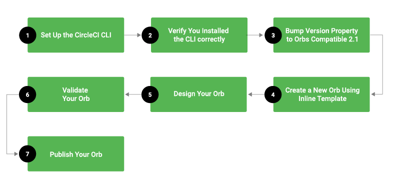

# Orbs + Sample of Orb

## Orbs
**CircleCI Orbs** are shareable packages of configuration elements, including jobs, commands, and executors. CircleCI provides certified orbs, along with 3rd-party orbs authored by CircleCI partners. It is best practice to first evaluate whether any of these existing orbs will help you in your configuration workflow. Refer to the [CircleCI Orbs Registry](https://circleci.com/orbs/registry/) for the complete list of certified orbs.

## Design Methodology
Before using orbs, you may find it helpful to understand the various design decisions and methodologies that were used when these orbs were designed. Orbs were designed with the following considerations:

- Orbs are transparent - If you can execute an orb, you and anyone else can view the source of that orb.

- Metadata is available - Every key can include a description key and an orb may include a description at the top level.

- Production orbs are always semantic versioned (semver’d) - CircleCI allows development orbs that have versions that start with dev:.

- Production orbs are immutable - Once an orb has been published to a semantic version, the orb cannot be changed. This prevents unexpected breakage or changing behaviors in core orchestration

- One registry (per install) - Each installation of CircleCI, including circleci.com, has only one registry where orbs can be kept.

## Orb Structure

Orbs consist of the following elements:

- Commands
- Jobs
- Executors

You can read about each of this features [here](version_2_1.md)

## Using CircleCI Orbs

If you have chosen to use CircleCI orbs in your workflows and jobs, there are several different ways that you use orbs. You may choose to either import an existing orb (CircleCI and partner-certified orbs) from the [CircleCI Orb Registry](https://circleci.com/orbs/registry/), or author your own orb for your specific workflow. Each of these approaches is described below.

### Importing an Existing and Partner Orb
To import an existing orb, perform the steps listed below.

1) Check version in your config `.circleci/config.yml` must be `2.1` or more and you must enable “pipelines” to use the orbs key.

2) Add the `orbs` below your version. For example:
```yml
version: 2.1

orbs:
  slack: circleci/slack@0.1.0
  heroku: circleci/heroku@0.0.1
```

### Sample of using orbs:

Before using the orb, you need to read the documentation for use which can be found on the main page of the orb

example of usage: 

```yml
version: 2.1

orbs:
  hello-build: circleci/hello-build@0.0.9

workflows:
  build:
    jobs:
      - hello-build/hello-build
```

## Creating a CircleCI Orb



### CircleCI Settings

- In the CircleCI app Settings page for your project, pipelines must be enabled (default is to be ON for all new projects).

- You need to set your API token in `User settings -> Personal API token`

**Note:** after creating the token, you can see it **only once**.

### Setup circleci CLI
To create orbs you need to setup the CircleCI CLI. 

How to **setup** circleci CLI you can see [**here**](https://github.com/rubygarage/circledge/blob/develop/local_setup.md)

### Configure circleci CLI

Run in your console: 
```
circleci setup
```
After running this command you need to set your API token and host (default "https://circleci.com")

**Note:** before running this command you need to **create** an API token in the UI

After setup host and API token you can to check your configurated CLI.
```
circleci diagnostic
```

Output: 
```
---
CircleCI CLI Diagnostics
---
Debugger mode: false
Config found: /Users/<username>/.circleci/cli.yml
API host: https://circleci.com
API endpoint: graphql-unstable
OK, got a token.
Trying an introspection query on API...
Ok.
Hello, <your name>.
```

### Change settings for organization to use not certified orbs

You need to go into the **UI settings** of your organization and allow the use of **not** certified orbs

### Create namespace 

Orbs are stored under specific namespaces. Before creating an orb, you need to **create a namespace** or use the existing one.

for create namespace run this command:

```
circleci namespace create <name> <VCS> <organization>
```

### Create and publish your own Orb

for creating orb run: 

```
circleci orb create <namespace>/<orb>
```

sample of orb:

```yml
version: 2.1
commands:
  say_hello:
    description: "A very simple command for demonstration purposes"
    parameters:
      to:
        type: string
        default: "Hello World"
    steps:
      - run: echo << parameters.to >>
```

After that you need to validate the orb you wrote. To do this, run the command:

```
circleci orb validate <path to your created orb> 
```

To use the orb you need to publish it on circleci. Run this command:

```
circleci orb publish <path> <namespace>/<orb>@<version>
```

We also created our own simple orb for saving and restoring cache - [kolyanjy/save_and_restore_cache](https://circleci.com/orbs/registry/orb/kolyanjy/save_and_restore_cache).

Example: 

```yml
version: 2.1

orbs:
  save_and_restore_cache: kolyanjy/save_and_restore_cache@0.1.3

jobs:
  lintering:
    executor: default
    steps:
      - checkout
      - save_and_restore_cache/take-cache:
          key: 'repo-bundle-v2'
```
