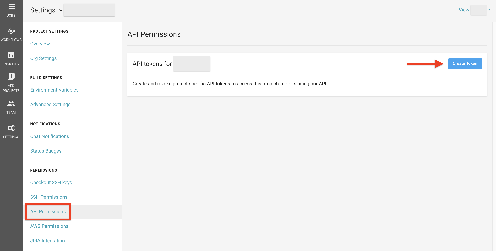

# Special Cases + examples

## Daily builds

It can be inefficient and expensive to run a workflow for every commit for every branch. Instead, you can schedule a workflow to run at a certain time for specific branches. This will disable commits from triggering jobs on those branches.

A `triggers` key should be added for indicating a scheduled build. Currently `triggers` have only one subkey - `schedule` which defines a certain time, for example a nightly build that runs every day at 00:00 :

```
workflows:
  version: 2
  commit:
    jobs:
      - test
      - deploy
  nightly:
    triggers:
      - schedule:
          cron: "0 0 * * *"
          filters:
            branches:
              only:
                - master
                - beta
    jobs:
      - coverage
```

`commit` and `nightly` are workflow names.

The `cron` key sets trigger time. It is defined using POSIX `crontab` syntax.

`filters` can have the key `branches`.

`branches` have subkeys `only` and `ignore` that give you an ability to choose which branch should have a schedule trigger created for it.

Example above executes builds when you push changes to a version control system and also every night on specified branches. You can use `nightly` workflow without any additional workflows, in this case there will be only 1 build execution per day.


## Manual Triggering

It can be useful when condionally running jobs or using it with github actions for example.

### `build` job triggering

With CircleCI API you can trigger `build` job manually. To make it you have to do several steps:

- go to user's Settings -> Personal API Tokens -> click Create New Token button

  

- use generated token in `curl` command:
  ```
  curl -X POST --header “Content-Type:application/json” --data '"parallel": 2, {"build_parameters": {"FOO":"BAR"}}' https://circleci.com/api/v1.1/project/:vcs-type/:user-organization/:project-name/tree/:branch\?circle-token=:your-token
  ```

  `parallel` is an optional key which defines number of containers to use to run the build.

  To `build_parameters` (also optional) you can pass additional environment variables to inject into the build environment.

  In URI from example above replace with your values:

  `:vcs-type` - github or bitbucket

  `:user-organization` - user or organization name

  `:project-name` - project name

  `:branch` - branch to run build

  `:your-token` - API token created before

In case you have not `build` job in your config file, you will see an error.

### `workflows` triggering

You can trigger `workflows` with command:

```
curl -X POST https://circleci.com/api/v1.1/project/:vcs-type/:user-organization/:project-name/build?circle-token=:your-token
```

The command above will trigger workflows for default branch. You can also specify which branch to trigger with parameter `branch`:

```
curl -X POST --header “Content-Type:application/json” --data '{"branch":":your-branch"}' https://circleci.com/api/v1.1/project/:vcs-type/:user-organization/:project-name/build?circle-token=:your-token
```
