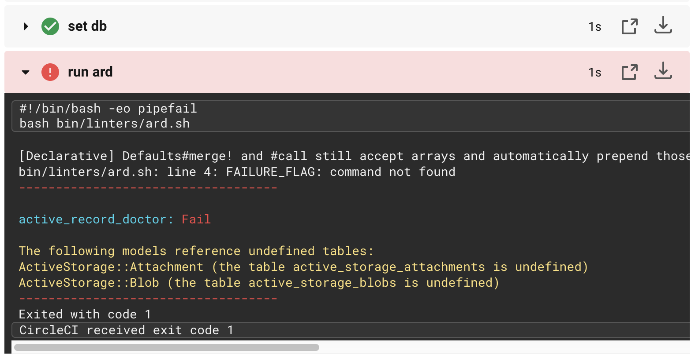

# Special Cases + examples

## 5. Lintering

There is an opportunity to control the quality of your code with a help of circleci using linters.
Continius intergration lintering is implemented via [pronto]([https://github.com/prontolabs/pronto](https://github.com/prontolabs/pronto)) or [overcommit]([https://github.com/sds/overcommit](https://github.com/sds/overcommit)) gem, but there are some cases when you need a linter which doesn't belong to the list of available gems pronto and overcommit, then you have to set it manually.

>### `lol_dba`

For example we want to run on CI linter  [lol_dba](https://github.com/plentz/lol_dba), current linter is not present in `pronto` or `overcommit` available gem list, so we need to setup it by-self.

1.  You need to pay attention to the position of your linter step:

	1.1 must always be realized before `rspec` launch

	1.2 must always be realized after `bundle install` launch

	1.3 and if we talk about `lol_dba` or `active_record_doctor` we need our project db ready, so put linter step `bundle exec rails db:migrate`

2.  CI runs on test environment so you need to move your gem to test group:
    ```
    group  :development, :test  do
      gem  'lol_dba', '~> 2.0'
    end
    ```
2.  Add to your `circleci/config.yml` a new step, which will execute `lol_dba.sh` file.
    ```
    steps:
      - run:
        name: run lol_dba
        command: bash bin/linters/lol_dba.sh
    ```

3.  From your project root directory create a `lol_dba.sh` file with this command
	  `mkdir bin/linters && touch bin/linters/lol_dba.sh`

4.  Fill in `lol_dba.sh` file with next content:

    ```
    #!/usr/bin/env bash

    OUTPUT=$(bundle exec lol_dba db:find_indexes)
    FAILURE_FLAG = 'AddMissingIndexes'

    # Exit with error message if output includes failure flag

    if [[ $OUTPUT =~ $FAILURE_FLAG ]]; then
      echo -e "\e[31m-----------------------------------\e[0;39m\n"
      echo -e "\e[96mlol_dba: \033[31mFail\033[0;39m\n"
      while read -r line; do
        echo -e "\e[33m$line"
      done <<< "$OUTPUT"
      echo -e "\033[31m-----------------------------------\033[0;39m"
      exit 1
    else
      echo -e "\e[96mlol_dba: \e[32mSuccess"
    fi
    ```
**That's it, the most important you should understand while creating custom linter step is that you need to specify a *FAILURE_FLAG* for your linter and handle it with error message and `exit` command.**

>### `rubocop`

If you want to setup some gem as `rubocop` which linter your ruby code and is not present in `pronto` or `overcommit` available gem list, you can do as in example below.

#### Collect differences between your brach and base branch
```
#!/usr/bin/env bash

BASE_REMOTE=origin
BASE_BRANCH=develop

git fetch $BASE_REMOTE $BASE_BRANCH

differences_list=()
commit_list=`git --no-pager log --no-merges $BASE_REMOTE/$BASE_BRANCH...$CIRCLE_BRANCH | grep -e '^commit' | sed -e "s/^commit \(.\{8\}\).*/\1/"`
changed_files_list = `git --no-pager diff $BASE_REMOTE/$BASE_BRANCH...$CIRCLE_BRANCH --name-only`

for file in $changed_files_list; do
  for commit in $commit_list; do
    differences=`git --no-pager blame --follow --show-name -s $file | grep $commit | sed -e "s/^[^ ]* *\([^ ]*\) *\([0-9]*\)*).*$/\1:\2/"`
    for line in $differences; do
      differences_list+=("$line")
    done
  done
done
```
#### Collect errors
```
error_counts=0
error_lines=()

while read line; do
  for difference in ${differences_list[@]}; do
    if [[ "$line" =~ "$difference" ]]; then
      error_counts=$(($error_counts + 1))
      error_lines+=("$line")
      break
    fi
  done
done < <(bundle exec rubocop --format emacs)
```
#### Exit with error message if error counts greater then zero
```
if [ $error_counts -ne 0 ]; then
  echo -e "\033[31m$error_counts Lint Errors\033[0;39m"
  echo -e "\033[31m-----------------------------------\033[0;39m\n"
  printf '\033[31m%s\n' "${error_lines[@]}"
  echo -e "\033[31mPlease resolve them before merging.\033[0;39m"
  exit 1
fi
```

>### `active_record_doctor`

To run `active_record_doctor` linter you can use same principle as with `lol_dba`. For example:

bin/linters/ard.sh:
```
#!/usr/bin/env bash

OUTPUT=$(bundle exec rake active_record_doctor:undefined_table_references)
FAILURE_FLAG = 'The following models reference undefined tables'

if [[ $OUTPUT =~ $FAILURE_FLAG ]]; then
  echo -e "\e[31m-----------------------------------\e[0;39m\n"
  echo -e "\e[96mactive_record_doctor: \033[31mFail\033[0;39m\n"
  while read -r line; do
    echo -e "\e[33m$line"
  done <<< "$OUTPUT"
  echo -e "\033[31m-----------------------------------\033[0;39m"
  exit 1
else
  echo -e "\e[96mactive_record_doctor: \e[32mSuccess"
fi
```

.circleci/config.yml:
```yml
version: 2
jobs:
  build:
    docker:
      - image: circleci/ruby:2.5.1-node-browsers
        environment:
          RAILS_ENV: test
      - image: circleci/postgres:9.6
        environment:
          POSTGRES_DB: test_db
          DATABASE_URL: "postgres://ubuntu@localhost:5432/test_db"

    working_directory: ~/repo

    steps:
      - checkout
      - run:
          name: Install dependencies
          command: |
            bundle install --jobs=4 --retry=3 --path vendor/bundle
      - run:
          name: set db
          command: bundle exec rake db:migrate
      - run:
          name: run ard
          command: bash bin/linters/ard.sh
      - run:
          name: Run tests
          command: bundle exec rspec
```

In case `active_record_doctor` fails you will see such output:

