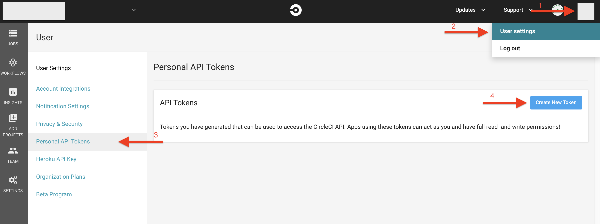

# Special Cases + examples

## Manual Triggering

It can be useful when condionally running jobs or using it with github actions for example.

### `build` job triggering

With CircleCI API you can trigger `build` job manually. To make it you have to do several steps:

- go to user's Settings -> Personal API Tokens -> click Create New Token button

  

- use generated token in `curl` command:
  ```
  curl -X POST --header “Content-Type:application/json” --data '"parallel": 2, {"build_parameters": {"FOO":"BAR"}}' https://circleci.com/api/v1.1/project/:vcs-type/:user-organization/:project-name/tree/:branch\?circle-token=:your-token
  ```

  `parallel` is an optional key which defines number of containers to use to run the build.

  To `build_parameters` (also optional) you can pass additional environment variables to inject into the build environment.

  In URI from example above replace with your values:

  `:vcs-type` - github or bitbucket

  `:user-organization` - user or organization name

  `:project-name` - project name

  `:branch` - branch to run build

  `:your-token` - API token created before

### `workflows` triggering

Triggering `workflows` is in preview mode now. Later you can run workflow with command:

```
curl -X POST https://circleci.com/api/v1.1/project/:vcs-type/:user-organization/:project-name/build?circle-token=:your-token
```

You will be able to specify the branch to build as a parameter.
